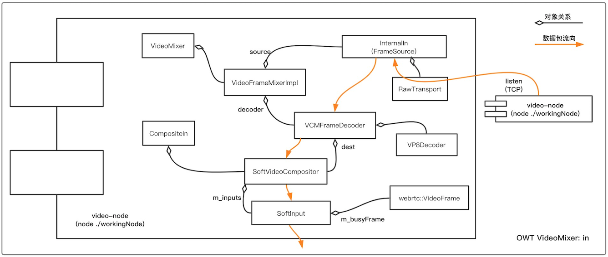
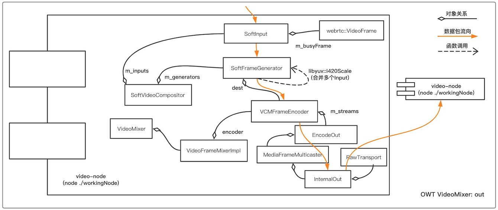

# OWT-DOCKER

Docker for [owt-server](https://github.com/open-webrtc-toolkit/owt-server) from Ubuntu18(`ubuntu:bionic`).

* `registry.cn-hangzhou.aliyuncs.com/ossrs/owt:4.3`：内网演示方式[Usage: HostIP](#usage-hostip)，配置好了`docker-host`域名。
* `registry.cn-hangzhou.aliyuncs.com/ossrs/owt:config`：修改了端口和脚本，参考[Port Range](#port-range)和[Auth Update](#auth-update)。
* `registry.cn-hangzhou.aliyuncs.com/ossrs/owt:pack`：完成了`pack.js`步骤，打包好了OWT。
* `registry.cn-hangzhou.aliyuncs.com/ossrs/owt:build`：完成了`build.js`步骤，编译好了OWT。
* `registry.cn-hangzhou.aliyuncs.com/ossrs/owt:system`：完成了`installDepsUnattended.sh`步骤，安装好了依赖。

> Note: 针对Docker下部署和使用OWT，我们修改了一些代码和配置，参考[Here](https://github.com/winlinvip/owt-server/compare/v4.3...feature/docker-v4.3)。

以MacPro为例，如何使用镜像搭建Demo，推荐使用[Usage: HostIP](#usage-hostip)，提供了几种常见的方式：

* 在内网用镜像搭建OWT，使用脚本自动获取IP，自动修改OWT配置文件中的IP，参考[Usage: HostIP](#usage-hostip)。
* 在内网使用镜像快速搭建OWT，需要修改IP，参考[Usage](#usage)。
* 有公网IP或域名时，用镜像搭建OWT服务，参考[Usage: Internet](#usage-internet)。

下面是本文涉及的重点：

* OWT开发环境搭建，本机快速部署，不用改IP，参考[Usage: HostIP](#usage-hostip)。
* OWT本机修改，可修改C++代码，在Docker中编译和运行，参考[Develop](#develop)。
* OWT调试js和WebRTC的C++代码，参考[Debug](#debug)。
* OWT几组性能数据，WebRTC性能不高，参考[Performance](#performance)。
* OWT存在的一些问题，参考[Issues](#issues)。
* OWT的程序结构，使用Nodejs调用C++代码，参考[CodeNodejs](CodeNodejs.md)。
* OWT的代码分析，参考[CodeVideo](CodeVideo.md)。

## Usage

下面我们以MacPro为例，如何使用镜像搭建内网Demo，其他OS将命令替换就可以。

**>>> Step 0: 当然你得有个Docker。**

可以从[docker.io](https://www.docker.com/products/docker-desktop)下载一个，安装就好了。
执行`docker version`，应该可以看到Docker版本：

```bash
Mac:owt-docker chengli.ycl$ docker version
Client:
 Version:	17.12.0-ce
Server:
  Version:	17.12.0-ce
```

**>>> Step 1: 通过Docker镜像，启动OWT环境。**

```bash
docker run -it -p 3004:3004 -p 3300:3300 -p 8080:8080 -p 60000-60050:60000-60050/udp \
    registry.cn-hangzhou.aliyuncs.com/ossrs/owt:config bash
```

> Note: Docker使用的版本是[owt-server 4.3](https://github.com/open-webrtc-toolkit/owt-server/releases/tag/v4.3), [owt-client 4.3](https://github.com/open-webrtc-toolkit/owt-client-javascript/releases/tag/v4.3), [IntelMediaSDK 18.4.0](https://github.com/Intel-Media-SDK/MediaSDK/releases/download/intel-mediasdk-18.4.0/MediaStack.tar.gz).

> Note: OWT需要开一系列范围的UDP端口，docker映射大范围端口会有问题，所以我们只指定了50个测试端口，已经在镜像中修改了配置，参考[Port Range](#port-range)。

> Note: 针对Docker下部署和使用OWT，我们修改了一些代码和配置，参考[Here](https://github.com/winlinvip/owt-server/compare/v4.3...feature/docker-v4.3)。

**>>> Step 2: 设置OWT的IP信息，设置为Mac的IP地址。也可以自动获取和设置IP，参考[Usage: HostIP](#usage-hostip)。**

```bash
# vi dist/webrtc_agent/agent.toml
[webrtc]
network_interfaces = [{name="eth0",replaced_ip_address="192.168.1.4"}]  # default: []

# vi dist/portal/portal.toml
[portal]
ip_address = "192.168.1.4" #default: ""
```

**>>> Step 3: 输入命令，初始化OWT和启动服务。**

```bash
(cd dist && ./bin/init-all.sh && ./bin/start-all.sh)
```

**>>> Step 4: 大功告成。**

打开OWT的默认演示页面，私有证书需要选择`Advanced => Proceed to xxx`：

* https://192.168.1.4:3004/

由于证书问题，第一次需要在浏览器，先打开OWT信令服务(Portal)页面（后续就不用了）：

* [https://192.168.1.4:8080/socket.io/?EIO=3&transport=polling&t=N2UmsIn](https://192.168.1.4:8080/socket.io/?EIO=3&transport=polling&t=N2UmsIn)

访问管理后台，注意启动服务时有个sampleServiceId和sampleServiceKey，打开页面会要求输入这个信息：

* https://192.168.1.4:3300/console

> Note: 我们也可以使用域名来访问OWT服务，这样就不用每次IP变更后修改配置文件，参考[Usage: HostIP](#usage-hostip)。

> Note: 目前提供OWT 4.3的镜像开发环境，若需要更新代码需要修改Dockerfile，或者参考[Deubg](#debug)重新编译。

还可以尝试其他方式，比如：

* 在内网使用镜像快速搭建OWT，需要修改IP，参考[Usage](#usage)。
* 在内网用镜像搭建OWT，使用脚本自动获取IP，自动修改OWT配置文件中的IP，参考[Usage: HostIP](#usage-hostip)。
* 有公网IP或域名时，用镜像搭建OWT服务，参考[Usage: Internet](#usage-internet)。

## Usage: HostIP

在之前[Usage](#usage)中，我们说明了如何在内网用镜像快速搭建OWT服务，但需要修改OWT的配置文件。
这里我们说明如何使用脚本自动获取IP，自动修改OWT配置文件中的IP。

下面我们以MacPro为例，如何使用镜像搭建内网Demo，其他OS将命令替换就可以。

**>>> Step 0: 当然你得有个Docker。**

可以从[docker.io](https://www.docker.com/products/docker-desktop)下载一个，安装就好了。
执行`docker version`，应该可以看到Docker版本：

```bash
Mac:owt-docker chengli.ycl$ docker version
Client:
 Version:	17.12.0-ce
Server:
  Version:	17.12.0-ce
```

**>>> Step 1: 先获取宿主机的IP，该IP需要在访问的机器上能Ping通。**

```bash
HostIP=`ifconfig en0 inet| grep inet|awk '{print $2}'` &&
echo "" && echo "" && echo "" && echo "OWT演示页面:" && echo "  https://$HostIP:3004/" &&
echo "第一次需要先访问信令(Portal)：" && echo "  https://$HostIP:8080/socket.io/?EIO=3&transport=polling&t=N2UmsIn"
```

或者直接设置为自己的IP：

```bash
HostIP="192.168.1.4" &&
echo "" && echo "" && echo "" && echo "OWT演示页面:" && echo "  https://$HostIP:3004/" &&
echo "第一次需要先访问信令(Portal)：" && echo "  https://$HostIP:8080/socket.io/?EIO=3&transport=polling&t=N2UmsIn"
```

**>>> Step 2: 通过Docker镜像，启动OWT环境。**

```bash
HostIP=`ifconfig en0 inet| grep inet|awk '{print $2}'` &&
docker run -it -p 3004:3004 -p 3300:3300 -p 8080:8080 -p 60000-60050:60000-60050/udp \
    --env DOCKER_HOST=$HostIP registry.cn-hangzhou.aliyuncs.com/ossrs/owt:4.3 bash
```

> Note: Docker使用的版本是[owt-server 4.3](https://github.com/open-webrtc-toolkit/owt-server/releases/tag/v4.3), [owt-client 4.3](https://github.com/open-webrtc-toolkit/owt-client-javascript/releases/tag/v4.3), [IntelMediaSDK 18.4.0](https://github.com/Intel-Media-SDK/MediaSDK/releases/download/intel-mediasdk-18.4.0/MediaStack.tar.gz).

> Note: OWT需要开一系列范围的UDP端口，docker映射大范围端口会有问题，所以我们只指定了50个测试端口，已经在镜像中修改了配置，参考[Port Range](#port-range)。

> Note: OWT对外提供了信令和媒体服务，所以需要返回可外部访问的IP地址，我们通过环境变量传递给Docker，参考[Docker Host IP](#docker-host-ip)。

> Note: 针对Docker下部署和使用OWT，我们修改了一些代码和配置，参考[Here](https://github.com/winlinvip/owt-server/compare/v4.3...feature/docker-v4.3)。

**>>> Step 3: 输入命令，初始化OWT和启动服务。**

```bash
(cd dist && ./bin/init-all.sh && ./bin/start-all.sh)
```

**>>> Step 4: 大功告成。**

打开OWT的默认演示页面，私有证书需要选择`Advanced => Proceed to 192.168.1.4 (unsafe)`：

* https://192.168.1.4:3004/

由于证书问题，第一次需要在浏览器，先打开OWT信令服务(Portal)页面（后续就不用了）：

* [https://192.168.1.4:8080/socket.io/?EIO=3&transport=polling&t=N2UmsIn](https://192.168.1.4:8080/socket.io/?EIO=3&transport=polling&t=N2UmsIn)

访问管理后台，注意启动服务时有个sampleServiceId和sampleServiceKey，打开页面会要求输入这个信息：

* https://192.168.1.4:3300/console

> Note: 我们使用域名来访问OWT服务，这样宿主机IP变更后，只需要执行脚本就可以，参考[Docker Host IP](#docker-host-ip)。

> Note: 目前提供OWT 4.3的镜像开发环境，若需要更新代码需要修改Dockerfile，或者参考[Deubg](#debug)重新编译。

还可以尝试其他方式，比如：

* 在内网使用镜像快速搭建OWT，需要修改IP，参考[Usage](#usage)。
* 在内网用镜像搭建OWT，使用脚本自动获取IP，自动修改OWT配置文件中的IP，参考[Usage: HostIP](#usage-hostip)。
* 有公网IP或域名时，用镜像搭建OWT服务，参考[Usage: Internet](#usage-internet)。

## Usage: Internet

> Remark: 下面说明公网IP或域名搭建OWT环境，若在内网或本机使用Docker快速搭建OWT开发环境，参考[Usage:](#usage)。

**>>> Step 1: 通过Docker镜像，启动OWT环境。**

```bash
docker run -it -p 3004:3004 -p 3300:3300 -p 8080:8080 -p 60000-60050:60000-60050/udp \
    registry.cn-hangzhou.aliyuncs.com/ossrs/owt:config bash
```

> Note: Docker使用的版本是[owt-server 4.3](https://github.com/open-webrtc-toolkit/owt-server/releases/tag/v4.3), [owt-client 4.3](https://github.com/open-webrtc-toolkit/owt-client-javascript/releases/tag/v4.3), [IntelMediaSDK 18.4.0](https://github.com/Intel-Media-SDK/MediaSDK/releases/download/intel-mediasdk-18.4.0/MediaStack.tar.gz).

> Note: OWT需要开一系列范围的UDP端口，docker映射大范围端口会有问题，所以我们只指定了50个测试端口，已经在镜像中修改了配置，参考[Port Range](#port-range)。

> Note: 针对Docker下部署和使用OWT，我们修改了一些代码和配置，参考[Here](https://github.com/winlinvip/owt-server/compare/v4.3...feature/docker-v4.3)。

**>>> Step 2: 配置公网IP或域名，参考[Use Internet Name](#use-internet-name)。**

```bash
# vi dist/webrtc_agent/agent.toml
[webrtc]
network_interfaces = [{name="eth0",replaced_ip_address="182.28.12.12"}]  # default: []

# vi dist/portal/portal.toml
[portal]
ip_address = "182.28.12.12" #default: ""
```

**>>> Step 3: 输入命令，初始化OWT和启动服务。**

```bash
(cd dist && ./bin/init-all.sh && ./bin/start-all.sh)
```

> Remark: 注意会有个提示是否添加MongoDB账号，可以忽略或写No（默认5秒左右就会忽略）。

**>>> Step 4: 大功告成。**

打开OWT的默认演示页面，私有证书需要选择`Advanced => Proceed to xxx`：

* https://182.28.12.12:3004/

由于证书问题，第一次需要在浏览器，先打开OWT信令服务(Portal)页面（后续就不用了）：

* [https://182.28.12.12:8080/socket.io/?EIO=3&transport=polling&t=N2UmsIn](https://182.28.12.12:8080/socket.io/?EIO=3&transport=polling&t=N2UmsIn)

访问管理后台，注意启动服务时有个sampleServiceId和sampleServiceKey，打开页面会要求输入这个信息：

* https://182.28.12.12:3300/console

> Note: 目前提供OWT 4.3的镜像开发环境，若需要更新代码需要修改Dockerfile，或者参考[Deubg](#debug)重新编译。

还可以尝试其他方式，比如：

* 在内网使用镜像快速搭建OWT，需要修改IP，参考[Usage](#usage)。
* 在内网用镜像搭建OWT，使用脚本自动获取IP，自动修改OWT配置文件中的IP，参考[Usage: HostIP](#usage-hostip)。
* 有公网IP或域名时，用镜像搭建OWT服务，参考[Usage: Internet](#usage-internet)。

## Develop

如果需要修改代码后编译：

1. 可以先将Docker代码拷贝出来。不用每次都拷贝，只有第一次需要拷贝。
1. 接着在本地修改OWT代码。可以用IDE等编辑器编辑代码，比较方便。
1. 然后挂载本地目录到Docker。挂载后，会以本地目录的文件，代替Docker中的文件。
1. 最后在Docker编译和运行OWT。如果修改的是JS，可以直接重启服务生效。

**>>> Step 1: 将Docker代码拷贝出来。**

首先，需要先运行Docker：

```bash
docker run -it registry.cn-hangzhou.aliyuncs.com/ossrs/owt:4.3 bash
```

然后，可以用`docker ps`，获取运行的容器ID，比如是`75647b1a7b16`：

```bash
Mac:owt-docker chengli.ycl$ docker ps
CONTAINER ID        IMAGE
75647b1a7b16        registry.cn-hangzhou.aliyuncs.com/ossrs/owt:4.3
```

接着，从运行的容器`75647b1a7b16`中拷贝OWT代码：

```bash
mkdir -p ~/git/owt-docker && cd ~/git/owt-docker &&
docker cp 75647b1a7b16:/tmp/git/owt-docker/owt-client-javascript-4.3 .
docker cp 75647b1a7b16:/tmp/git/owt-docker/owt-server-4.3 .
```

这样，我们就有了OWT 4.3的代码，接下来就可以在本地修改代码了。

> Note: 当然，也可以直接从OWT下载最新代码，映射到Docker后编译执行，注意只映射source目录到Docker。

**>>> Step 2: 在本地修改OWT代码。**

我们举个栗子，我们修改OWT，支持使用环境变量`DOCKER_HOST`来指定`portal.ip_address`。

> Note: Docker运行时，可以通过`--env DOCKER_HOST='192.168.1.4'`设置环境变量，这样在Docker中就可以通过获取环境变量来获取IP。

修改文件`source/portal/index.js`，参考[118d225f](https://github.com/winlinvip/owt-server/commit/118d225febefd35b7ec06a32791c986d8adade6c)：

```js
if (config.portal.ip_address.indexOf('$') == 0) {
    config.portal.ip_address = process.env[config.portal.ip_address.substr(1)];
    log.info('ENV: config.portal.ip_address=' + config.portal.ip_address);
}
```

修改文件`source/portal/portal.toml`，将信令Portal的`ip_address`引用环境变量：

```bash
[portal]
ip_address = "$DOCKER_HOST" #default: ""
```

> Remark: 这里我们只修改了JS代码，也可以修改c++代码。

**>>> Step 3: 挂载本地目录到Docker。**

启动Docker，并将本地目录挂载到Docker：

```bash
cd ~/git/owt-docker/owt-server-4.3 &&
HostIP=`ifconfig en0 inet| grep inet|awk '{print $2}'` &&
docker run -it -p 3004:3004 -p 3300:3300 -p 8080:8080 -p 60000-60050:60000-60050/udp \
    --env DOCKER_HOST=$HostIP -v `pwd`:/tmp/git/owt-docker/owt-server-4.3 \
    registry.cn-hangzhou.aliyuncs.com/ossrs/owt:4.3 bash
```

**>>> Step 4: 在Docker编译和运行OWT。**

若修改了c++代码，则需要编译OWT（若没有修改则可以忽略）：

```bash
./scripts/build.js -t all --check --debug
```

> Remark: 注意我们加了debug参数，编译出调试版本。

这个例子中，我们只修改了JS文件，所以直接打包就可以：

```bash
./scripts/pack.js -t all --debug --addon-debug --install-module --sample-path $CLIENT_SAMPLE_PATH
```

> Remark: 注意我们加了debug参数，打包调试版本。

为了保持命令行一直，我们将`dist-debug`链接为`dist`：

```bash
ln -sf dist-debug dist
```

可以看到，`dist/portal/portal.toml`和`dist/portal/index.js`这两个文件都更新了。

启动服务后，就可以看到修改生效了：

```bash
(cd dist && ./bin/init-all.sh && ./bin/start-all.sh)
```

## Debug

供Debug用的镜像：

* `registry.cn-hangzhou.aliyuncs.com/ossrs/owt:debug`：内网演示方式[Usage: HostIP](#usage-hostip)，配置好了`docker-host`域名。
* `registry.cn-hangzhou.aliyuncs.com/ossrs/owt:config-debug`：修改了端口和脚本，参考[Port Range](#port-range)和[Auth Update](#auth-update)。
* `registry.cn-hangzhou.aliyuncs.com/ossrs/owt:build-debug`：完成了`build.js`步骤，编译好了OWT。
* `registry.cn-hangzhou.aliyuncs.com/ossrs/owt:system`：完成了`installDepsUnattended.sh`步骤，安装好了依赖。

> Note: 针对Docker下调试OWT，我们修改了一些代码和配置，参考[Here](https://github.com/winlinvip/owt-server/compare/v4.3...feature/debug-v4.3)。

我们举个例子，调试OWT中的WebRTC Agent的代码。

**>>> Step 0: 一定要使用调试版本的镜像。**

为了方便调试，请使用调试镜像`registry.cn-hangzhou.aliyuncs.com/ossrs/owt:debug`，我们修改了几个地方：

* 设置WebRTC Agent的进程数目为1，可以直接调试这个进程，不然多个进程每个进程都要设置断点，会比较麻烦（也可以调试）。
* 设置`nodeManager`的超时时间为3000秒(即50分钟)，默认是3秒，所以很容易在设置断点或单步运行时进程被杀掉，导致调试失败。
* 日志级别全部设置为`DEBUG`，会显示更多的详细的日志，文件为`log4js_configuration.json`。
* 设置`amqp_client`的超时时间为2000秒(即33分钟)，默认是2秒，所以会在调试时导致各种超时。

推荐使用debug镜像启动，若不使用debug镜像，你也可以手动修改你的OWT，改动参考[这里](https://github.com/winlinvip/owt-server/compare/v4.3...feature/debug-v4.3)：

```bash
# 编译OWT时使用特殊的参数
./scripts/build.js -t all --check --debug

# vi dist/webrtc_agent/agent.toml +3
[agent]
maxProcesses = 1 #default: 13
prerunProcesses = 1 #default: 2

# vi dist/webrtc_agent/log4js_configuration.json +13
"ClusterWorker": "DEBUG",
"LoadCollector": "DEBUG",
"AmqpClient": "DEBUG",
"WorkingJS": "DEBUG",
"NodeManager": "DEBUG",
"WebrtcNode": "DEBUG",
"WrtcConnection": "DEBUG",
"Connection": "DEBUG",
"Sdp": "DEBUG",
"WorkingAgent": "DEBUG",
"Connections": "DEBUG",
"InternalConnectionFactory": "DEBUG"

# vi dist/webrtc_agent/nodeManager.js +125
child.check_alive_interval = setInterval(function() {
}, 3000000);

# vi dist/webrtc_agent/amqp_client.js +10
var TIMEOUT = 2000000;
```

> Note: 如果需要调试其他模块，也需要修改这些参数。

> Remark: 页面超时是由后端决定的，只需要修改后端的`amqp_client.js`的超时就可以。

**>>> Step 1: 启动debug镜像。**

启动Docker，添加gdb需要的参数`--privileged`：

```bash
HostIP=`ifconfig en0 inet| grep inet|awk '{print $2}'` &&
docker run -it -p 3004:3004 -p 3300:3300 -p 8080:8080 -p 60000-60050:60000-60050/udp \
    --privileged --env DOCKER_HOST=$HostIP \
    registry.cn-hangzhou.aliyuncs.com/ossrs/owt:debug bash
```

当然，若需要挂载本地目录，可以按照上一步修改本地代码，或者从debug镜像将代码拷贝出来，然后执行：

```bash
cd ~/git/owt-docker/owt-server-4.3 &&
HostIP=`ifconfig en0 inet| grep inet|awk '{print $2}'` &&
docker run -it -p 3004:3004 -p 3300:3300 -p 8080:8080 -p 60000-60050:60000-60050/udp \
    --privileged --env DOCKER_HOST=$HostIP -v `pwd`:/tmp/git/owt-docker/owt-server-4.3 \
    registry.cn-hangzhou.aliyuncs.com/ossrs/owt:debug bash
```

启动OWT服务：

```bash
(cd dist && ./bin/init-all.sh && ./bin/start-all.sh)
```

**>>> Step 2: 启动GDB调试WebRTC Agent进程。**

启动GDB调试，并Attach调试WebRTC Agent的进程：

```bash
gdb --pid `ps aux|grep webrtc|grep workingNode|awk '{print $2}'`
```

然后设置断点，比如可以设置在函数上，或者在文件的某一行：

```bash
b WebRtcConnection.cc:346
c
```

> Note: 设置断点后，执行`continue`或者`c`，继续跑程序。

**>>> Step 3: 打开页面，命中断点。**

打开页面，就会进入断点了：

```bash
Thread 1 "node" hit Breakpoint 1, WebRtcConnection::addRemoteCandidate (info=...) at ../WebRtcConnection.cc:313
313	  WebRtcConnection* obj = Nan::ObjectWrap::Unwrap<WebRtcConnection>(info.Holder());
(gdb) bt
#0  0x00007fe00d7affac in WebRtcConnection::addRemoteCandidate(Nan::FunctionCallbackInfo<v8::Value> const&) (info=...) at ../WebRtcConnection.cc:313
#1  0x00007fe00d7a9243 in Nan::imp::FunctionCallbackWrapper(v8::FunctionCallbackInfo<v8::Value> const&) (info=...)
    at ../../../../../node_modules/nan/nan_callbacks_12_inl.h:179
#2  0x000055c7c8302d0f in v8::internal::FunctionCallbackArguments::Call(void (*)(v8::FunctionCallbackInfo<v8::Value> const&)) ()
#3  0x000055c7c836bb62 in  ()
```

GDB是非常强大的调试工具，详细命令参考[Debugging with GDB](http://sourceware.org/gdb/current/onlinedocs/gdb/)。

> Note: 也可以使用`node inspect xxx.js`调试js程序。

> Remark: OWT使用Nodejs的NAN调用C++代码，调试原理参考[CodeNodejs](CodeNodejs.md#nodejs-nan-debug)，代码结构参考[CodeNodejs](CodeNodejs.md#nodejs-nan-owt)。

## Dependencies

OWT会安装很多依赖的库，详细可以参考Dockerfile中安装的依赖。

这些代码和依赖都会在docker中，下载代码包括：

* node_modules/nan
* build, 734M
    * build/libdeps/ffmpeg-4.1.3.tar.bz2
    * build/libdeps/libnice-0.1.4.tar.gz
    * build/libdeps/openssl-1.0.2t.tar.gz
    * build/libdeps/libsrtp-2.1.0.tar.gz
* third_party, 561M
    * third_party/quic-lib, 8.4M
    * third_party/licode, 34M
    * third_party/openh264, 33M
    * third_party/SVT-HEVC, 39M
    * third_party/webrtc, 448M

## Port Range

Docker由于需要映射端口，所以如果需要开特别多的UDP端口会有问题，Mac下的Docker能开50个左右的UDP端口，测试是够用了。

我们在镜像中已经修改了配置文件，将端口范围改成了`60000-60050/udp`，如果有需要可以自己改：

```bash
# vi dist/webrtc_agent/agent.toml
[webrtc]
maxport = 60050 #default: 0
minport = 60000 #default: 0
```

> Note: 注意别改错了，还有另外个地方也有这个配置，`[internal]`这个是配置集群的(内部传输的端口比如webrtc-agent和video-agent之间的传输端口)，单个Docker不用修改。

## Docker Host IP

OWT在Docker中运行时，Docker就相当于一个局域网，OWT获取到地址是个内网IP，在外面是无法访问的，所以需要修改配置。

比如，我们在Docker中查看OWT的IP，可以发现是`eth0 172.17.0.2`：

```bash
root@d3041e7dd80d:/tmp/git/owt-docker/owt-server-4.3# ifconfig eth0| grep inet
        inet 172.17.0.2  netmask 255.255.0.0  broadcast 172.17.255.255
```

我们在Host机器（也就是运行Docker的机器上）查看IP，可以发现是`en0 192.168.1.4`(以Mac为例)：

```bash
Mac:owt-docker chengli.ycl$ ifconfig en0 inet|grep inet
	inet 192.168.1.4 netmask 0xffffff00 broadcast 192.168.1.255
```

那么我们就需要修改OWT的配置，让它知道自己应该对外使用`192.168.1.4`这个宿主机的地址（当然如果有公网IP也可以）。

* `dist/webrtc_agent/agent.toml`，修改`[webrtc]`中的`network_interfaces`，是媒体流的服务地址。
* `dist/portal/portal.toml`，修改`[portal]`中的`ip_address`，是信令的服务地址。

Docker提供了更好的办法，可以将宿主机的IP(192.168.1.4)通过`--env`传给OWT，通过读取环境变量获取IP：

```bash
HostIP=`ifconfig en0 inet| grep inet|awk '{print $2}'` &&
docker run -it --env DOCKER_HOST=$HostIP \
    registry.cn-hangzhou.aliyuncs.com/ossrs/owt:4.3 bash
```

> Remark: 注意应该映射端口，这里为了强调域名就没有把端口映射写上。

这样在Docker中就可以知道宿主机的IP地址了（或者公网IP也可以）：

```bash
root@d5a5bc41169e:/tmp/git/owt-docker/owt-server-4.3# echo $DOCKER_HOST
192.168.1.4
```

我们就可以将OWT对外暴露的服务，修改为环境变量`$DOCKER_HOST`，避免每次启动都要改配置：

```bash
# vi dist/webrtc_agent/agent.toml
[webrtc]
network_interfaces = [{name="eth0",replaced_ip_address="$DOCKER_HOST"}]  # default: []

# vi dist/portal/portal.toml
[portal]
ip_address = "$DOCKER_HOST" #default: ""
```

启动OWT时，会被替换成IP地址。

> Remark: 注意我们在Docker中修改了OWT，提交了PR参考[]()

<a name="use-internet-name"></a>

当然，若有公网可以访问的域名，或者公网IP，直接修改为IP或域名也可以：

```bash
# vi dist/webrtc_agent/agent.toml
[webrtc]
network_interfaces = [{name="eth0",replaced_ip_address="192.168.1.4"}]  # default: []

# vi dist/portal/portal.toml
[portal]
ip_address = "192.168.1.4" #default: ""
```

## Auth Update

若使用镜像`registry.cn-hangzhou.aliyuncs.com/ossrs/owt:pack`，没有修改UDP端口，也没有修改脚本，启动OWT时会提示：

```bash
Update RabbitMQ/MongoDB Account? [No/Yes]
```

会在10秒后默认选择No，我们修改了这个脚本`dist/bin/init-all.sh`：

```bash
if ${HARDWARE}; then
  echo "Initializing with hardware msdk"
  init_hardware
  #init_auth
else
  echo "Initializing..."
  init_software
  #init_auth
fi
```

这样就默认不会更新MongoDB和RabbitMQ的认证信息，直接启动服务了。

## Performance

MacPro信息：

* macOS Mojave
* Version 10.14.6 (18G3020)
* MacBook Pro (Retina, 15-inch, Mid 2015)
* Processor: 2.2 GHz Intel Core i7
* Memory: 16 GB 1600 MHz DDR3

Docker信息：

* Docker Desktop 2.2.0.3(42716)
* Engine: 19.03.5
* Resources: CPUs 4, Memory 4GB, Swap 1GB

<a name="performance-owt"></a>

下面是不同人数和模式的测试数据:

| 模式 | 参数 | 人数 | CPU | CPU<br/>(webrtc) | CPU<br/>(video) | CPU<br/>(audio) | Memory | Memory<br/>(webrtc) | Memory<br/>(video) | Memory<br/>(audio) | Load |
| ---  | ---    |  --- | --- | ---              | ---             | ---             | ---    | ---                 | ---                | -----              | ---  |
| MCU | 无 | 2 | 72% | 28% | 32% | 12% | 238MB | 93MB | 85MB | 56MB | 2.38 |
| MCU | 无 | 4 | 119% | 44% | 57% | 18% | 267MB | 98MB | 94MB | 75MB | 3.41 |
| SFU | forward=true | 2 | 35% | 35% | 0% | 0% | 64MB | 64MB | 0MB | 0MB | 2.38 |
| SFU | forward=true | 4 | 87% | 87% | 0% | 0% | 95MB | 95MB | 0MB | 0MB | 9.29 |
| MCU | forward=true | 2 | 61% | 39% | 22% | 0% | 121MB | 64MB | 57MB | 0MB | 4.81 |
| MCU | forward=true | 4 | 130% | 91% | 24% | 14% | 230MB | 93MB | 65MB | 72MB | 9.83 |

> Note: 默认是MCU+SFU模式，SFU模式参考[SFU Mode](#sfu-mode)。

> Note: 删除Views是指在管理后台，例如 https://192.168.1.4:3300/console/ 的房间设置中，删除Views然后Apply。

> Note: Intel的朋友反馈，在一台8核3.5GHZUbuntu机器(台式机)上，给Docker分配4核4GB内存，跑4个SFU，CPU占用率38%左右(WebRTC)。同样条件，4个MCU页面，CPU使用87%，其中WebRTC占用22%，MCU占用65%(视频46%、音频19%)。

<a name="performance-webrtc-agent"></a>

下面是WebRTC这个Agent的性能指标：

| 模式 | 人数 | CPU | Memory | Threads | 线程增长 |
| --- | --- | ----- | ----- | ---     | --- |
| MCU | 0 |  0% | 47MB | 36 | - |
| MCU | 1 | 11% | 58MB | 46 | - |
| MCU | 2 | 24% | 62MB | 55 | 19% |
| MCU | 3 | 37% | 67MB | 64 | 16% |
| MCU | 4 | 62% | 72MB | 73 | 14% |

> Note: 可以看到，由于直接使用了WebRTC，使用的线程数和人数正关联，限制了能支持的并发数目。由于WebRTC不涉及编解码运算，属于IO密集型，个人觉得这里有可以提升的空间。

下面是Video这个Agent的性能指标：

| 模式 | 人数 | CPU | Memory | Threads | 线程增长 |
| --- | --- | ----- | ----- | ---     | --- |
| MCU | 0 |  0% | 46MB | 10 | - |
| MCU | 1 | 18% | 66MB | 20 | - |
| MCU | 2 | 22% | 71MB | 21 | 5% |
| MCU | 3 | 33% | 78MB | 22 | 4% |
| MCU | 4 | 74% | 83MB | 23 | 4% |

下面是Audio这个Agent的性能指标：

| 模式 | 人数 | CPU | Memory | Threads | 线程增长 |
| --- | --- | ----- | ----- | ---     | --- |
| MCU | 0 | 0.3% | 43MB | 10 | - |
| MCU | 1 | 4.7% | 47MB | 16 | - |
| MCU | 2 | 9.3% | 53MB | 20 | 25% |
| MCU | 3 | 13% | 63MB | 24 | 20% |
| MCU | 4 | 26% | 73MB | 28 | 16% |

> Note: Video和Audio都是编解码运算，是CPU密集型，线程随人数正向增长符合预期。

## SFU Mode

OWT默认是MCU+SFU模式，比如打开两个页面：

* https://192.168.1.4:3004 两个人各自推送一路流，拉一路流，这路流是MCU合流的。
* https://192.168.1.4:3004/?forward=true 两个人各自推送一路流，拉独立的两路流，同时OWT还在后台转了一路MCU的流。

其实上面的`forward=true`，并不是仅仅只有SFU模式，只是拉了转发的流。若需要关闭MCU模式，只开启SFU：

1. 打开管理后台：https://192.168.1.4:3300/console
1. 输入ServiceID和Key，在启动OWT服务时，会打印出来，比如：`sampleServiceId`和`sampleServiceKey`。
1. 进入后台后，可以看到Room，`View Count`默认是1，选择`Detail`，看到详细的房间配置。
1. 在Room配置中，Views那一节，点按钮`Remove`，删除views配置，在页面最底下点对勾提交。
1. 点`Apply`按钮应用房间配置，这时候可以看到`View Count`是0。

这样操作后，再打开页面就只有SFU模式了，不再有video和audio的进程消耗CPU：https://192.168.1.4:3004/?forward=true

> Note: SFU模式下，可以停止掉video-agent和audio-agent，流直接通过webrtc-agent中转。

> Note: MCU模式下，推流先到webrt-agent，video会新建TCP连接从webrtc-agent拉流。每个人的订阅，都会从webrtc-agent拉合屏的流，webrtc-agent从video新建个TCP连接拉流。

## Notes

* [CodeNodejs](CodeNodejs.md) 关于程序结构，调用关系，Nodejs和C++代码如何组合。
    * [Scripts](CodeNodejs.md#scripts) 启动脚本分析。
    * [Nodejs](CodeNodejs.md#nodejs) 调试Nodejs脚本。
    * [Schedule](CodeNodejs.md#schedule) 调度，如何分配webrtc-agent。
    * [WorkingNode](CodeNodejs.md#workingnode) webrtc工作进程的启动和管理。
    * [WebRTC](CodeNodejs.md#webrtc) Nodejs如何调用WebRTC代码。
    * [Videojs NAN](CodeNodejs.md#nodejs-nan)Videojs如何调用C++代码。
* [CodeVideo](CodeVideo.md) 关于MCU的video处理部分，如果获取原始视频流，合屏，转码。
    * [Scripts](CodeVideo.md#scripts) 启动脚本，调试nodejs部分。
    * [Heartbeat](CodeVideo.md#heartbeat) nodejs子进程和心跳消息。
    * [Load Balancer](CodeVideo.md#load-balancer) nodejs子进程负载均衡。
    * [Schedule](CodeVideo.md#schedule) 调度到video进程处理视频。
    * [VideoNode](CodeVideo.md#videonode) video的处理流程，和webrtc-agent的通信，mixer和transcoder。
    * [GDB Debug](CodeVideo.md#gdb-debug) 如何使用GDB调试C++代码。
    * [VideoMixer In](CodeVideo.md#videomixer-in) mixer输入部分，从webrtc-agent读取数据，读取Frame，解码。
    * [VideoMixer Out](CodeVideo.md#videomixer-out) mixer输出部分，合流，编码，输出到webrtc-agent。


> Note: [VideoNode](CodeVideo.md#videonode) video的处理流程，和webrtc-agent的通信，mixer和transcoder。



> Note: [VideoMixer In](CodeVideo.md#videomixer-in) mixer输入部分，从webrtc-agent读取数据，读取Frame，解码。



> Note: [VideoMixer Out](CodeVideo.md#videomixer-out) mixer输出部分，合流，编码，输出到webrtc-agent。

## Issues

1. OWT UDP端口没有复用，导致需要开一系列端口，参考[Port Range](#port-range)。
1. OWT对外的服务发现，也就是返回给客户端的信令和UDP的IP，是通过配置文件，参考[Docker Host IP](#docker-host-ip)。
1. OWT的webrtc_agent，使用WebRTC收发流，线程数会随着用户数增多而增多，导致SFU模式下也不能有很高并发，参考[Performance: webrtc-agent](#performance-webrtc-agent)。
1. OWT实现了完整的集群，包括Node的负载管理和调度，服务发现和路由，而实际中比较复杂的业务系统会有自己的调度和服务管理，这导致OWT集成到现有系统比较复杂，参考[OWT Schedule](CodeNodejs.md#schedule)。
1. OWT选择的是多PC，MCU下就是2个PC，SFU下会有很多个PC。人数比较多时OWT的SFU工作不太好，不过可以选择MCU模式。
1. OWT每个进程一个日志文件，日志没有业务逻辑区分，全链路排查问题时会比较困难，比如一个进程服务了30个人，一般有问题的是几个人，怎么把有问题的人的日志分离出来。
1. OWT依赖nodejs，每次打包都会下载N多个依赖，而且是从网络上下载，有时候就是会一直失败。

